# ReceiptLedger

**Turning physical receipt photos into structured, categorized spending intelligence.**

---

## Overview

Tracking cash expenditures across households and small businesses is hindered by loose, mixed receipts—ranging from printed supermarket invoices to informal handwritten corner-store (*kiryana*) slips. Manual ledger entry is friction-heavy and consistently abandoned.

**ReceiptLedger** provides an automated ingestion and analytics pipeline: photograph any physical receipt on mobile, extract line items and costs via specialized OCR paths, normalize merchant naming, classify items into local spending categories, and visualize monthly trends on an interactive dashboard.

---

## End-to-End Workflow

```mermaid
flowchart LR
    A["Paper Receipt<br/>(Printed / Handwritten)"] --> B["Mobile Capture &<br/>Edge Correction"]
    B --> C{"OCR Router"}
    C -->|"Printed Slip"| D1["Cloud Vision API /<br/>Tesseract"]
    C -->|"Handwritten Note"| D2["EasyOCR Engine &<br/>Binarization"]
    D1 --> E["Item Normalization &<br/>Fuzzy Matcher"]
    D2 --> E
    E --> F["Deduplication &<br/>Rule Categorizer"]
    F --> G[("PostgreSQL Ledger<br/>(Supabase)")]
    G --> H["Analytics Dashboard &<br/>Review Queue"]

    style A fill:#1E293B,stroke:#475569,stroke-width:1px,color:#F8FAFC
    style B fill:#0F766E,stroke:#14B8A6,stroke-width:1px,color:#F0FDFA
    style C fill:#1D4ED8,stroke:#3B82F6,stroke-width:1px,color:#EFF6FF
    style D1 fill:#4338CA,stroke:#6366F1,stroke-width:1px,color:#EEF2FF
    style D2 fill:#6D28D9,stroke:#8B5CF6,stroke-width:1px,color:#F5F3FF
    style E fill:#B45309,stroke:#F59E0B,stroke-width:1px,color:#FFFBEB
    style F fill:#047857,stroke:#10B981,stroke-width:1px,color:#ECFDF5
    style G fill:#334155,stroke:#64748B,stroke-width:1px,color:#F8FAFC
    style H fill:#0369A1,stroke:#0284C7,stroke-width:1px,color:#F0F9FF
```

---

## Core Capabilities

| Subsystem | Stack / Tool | Scope |
|:---|:---:|:---|
|  | Flutter | Single and batch receipt photo capture with edge preview and perspective deskewing. |
|  | Cloud Vision API / Tesseract | High-accuracy text and pricing extraction from structured retail register receipts. |
|  | EasyOCR + OpenCV | Character and numeric extraction tailored for informal small-shop receipts. |
|  | Levenshtein Matcher | Mapping colloquial names and local units into canonical retail items. |
|  | 64-bit pHash + SHA-256 | Preventing double-counting via visual hashing and metadata comparison. |
|  | Priority Rule Engine | Auto-sorting purchases into household spending categories (groceries, utilities, etc.). |
|  | React + Chart.js | Visualizing monthly spend, category distribution, and human-in-the-loop review queue. |

---

## Project Boundaries

### 
* **Mobile Ingestion:** Guided camera capture for single or multiple receipts.
* **Dual Text Extraction:** Separate processing pipelines for printed retail receipts and handwritten slips.
* **Item Standardization:** Canonical dictionary mapping for local product names and pack units.
* **Automated Categorization:** Rule-based tagging across common household expense categories.
* **Duplicate Detection:** Visual and textual validation against re-uploaded slips.
* **Spending Dashboard:**
  * Month-over-month expenditure comparison and variance tracking.
  * Category breakdown charts and multi-month spend velocity.
  * Filterable historical receipt ledger and item drill-down.
  * Review queue for verifying items with OCR confidence $< 0.85$.

### 
* Direct bank account integration or card statement reconciliation.
* Tax computation, GST filing, or legal invoice generation.
* Generic corporate categorization outside common consumer and retail goods.
* Training custom machine learning models from scratch.

## Documentation

Complete specifications and design artifacts are located under [`docs/specifications/`](docs/specifications/):

| Document | Summary |
|:---|:---|
| [**PRD**](docs/specifications/01_PRD.md) | Vision, target personas, and functional priority matrix |
| [**SRS**](docs/specifications/02_SRS.md) | IEEE 830 functional/non-functional requirements and API schemas |
| [**SDS**](docs/specifications/03_SDS.md) | Subsystem architecture, pipeline routing, and sequence flows |
| [**DFD**](docs/specifications/04_DFD.md) | Level 0 Context Model and Level 1 Functional Decomposition |
| [**ERD**](docs/specifications/05_ERD.md) | 3NF relational database schema and PostgreSQL/Supabase DDL |
| [**Semantic Networks**](docs/specifications/06_SEMANTIC_NETS.md) | Domain knowledge graphs, local item taxonomies, and unit hierarchies |
| [**3-Week Sprint Plan**](docs/specifications/07_SPRINT_PLAN_3WEEKS.md) | Compressed sprint timeline, backlog tickets, and exit criteria |

---

## Project Team

<table>
  <tr>
    <td align="center" width="33%">
        
      <b>Aazmeer Sarfaraz Faridy</b> 
      
    </td>
    <td align="center" width="33%">
        
      <b>Arish Ahmed Khan</b> 
      
    </td>
    <td align="center" width="33%">
        
      <b>Iman Hussain</b> 
      
    </td>
  </tr>
  <tr>
    <td align="center" width="33%">
        
      <b>Muhammad Asad Khan</b> 
      
    </td>
    <td align="center" width="33%">
        
      <b>Syed Aun Shamsi</b> 
      
    </td>
    <td align="center" width="33%">
        
      <b>Zainab Hashmi</b> 
      
    </td>
  </tr>
</table>

---

  Software Project Management (SPM-458) • Department of Computer Science • University of Karachi

