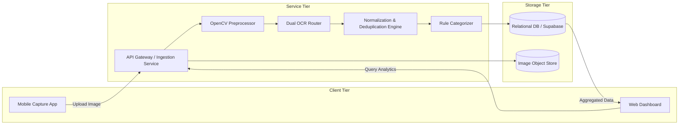

# Software Requirements Specification (SRS)
## Based on IEEE Std 830-1998 Format

### Project: ReceiptLedger
* **Document Version:** 1.0.0
* **Course:** Software Project Management (SPM-458)
* **Institution:** Department of Computer Science, University of Karachi
* **Sprint Cycle:** 3-Week Delivery Lifecycle

---

## 1. Introduction

### 1.1 Purpose
This Software Requirements Specification (SRS) specifies the complete functional and non-functional requirements for the ReceiptLedger system. It serves as the formal baseline for developers, quality assurance testers, and project evaluators throughout the 3-week sprint timeline.

### 1.2 Scope of the System
ReceiptLedger is an automated expense digitization and spending intelligence system consisting of:
* A mobile client for capturing and preprocessing receipt photos.
* A server-side processing pipeline featuring dual OCR processing (Google Cloud Vision API / Tesseract for printed slips, EasyOCR + OpenCV for handwritten notes), dictionary-based normalization, and rule-based spending categorization.
* A PostgreSQL/Supabase database storing structured receipt data.
* A React-based web dashboard displaying financial summaries, category analytics, and a manual review queue.

### 1.3 Definitions, Acronyms, and Abbreviations
* **OCR:** Optical Character Recognition.
* **pHash:** Perceptual Hashing (used for image similarity detection).
* **Levenshtein Distance:** A metric for measuring the difference between two sequence strings, utilized in fuzzy matching.
* **SoW:** Statement of Work.
* **Review Queue:** A dedicated dashboard view holding low-confidence extracted records awaiting human verification.

### 1.4 References
* SPM-458 Course Syllabus and Project Charter (`docs/project-management/ReceiptLedger_Project_Charter.pdf`).
* ReceiptLedger Statement of Work v3 (`docs/project-management/ReceiptLedger_SoW_v3.pdf`).
* IEEE Std 830-1998 Recommended Practice for Software Requirements Specifications.

---

## 2. Overall Description

### 2.1 Product Perspective
ReceiptLedger operates as a client-server architecture. The mobile client interacts with the backend over secure HTTPS REST endpoints, while the backend orchestrates image preprocessing, external OCR APIs, local fuzzy matching engines, and persistent data stores.



### 2.2 User Characteristics
* **End Users:** General consumers and small shop owners with everyday smartphone literacy. Requires minimal manual data entry.
* **System Evaluator / Instructor:** Humera Azam (SPM-458 Evaluator) validating system deliverables against the approved Charter and SoW.

### 2.3 General Constraints
1. **Free Tier Constraint:** The system must run entirely within free tiers or open-source software (Google Cloud Vision free tier up to 1,000 requests/month, Supabase free tier, Vercel free tier).
2. **Time Constraint:** Delivery is constrained to a 3-week timeline (Sprint 1, Sprint 2, Sprint 3).
3. **Hardware Constraint:** Server workloads must run on standard CPU environments without requiring dedicated GPU acceleration.

---

## 3. Specific System Requirements

### 3.1 Functional Requirements

#### FR-1: Image Acquisition & Preprocessing
* **Description:** The mobile client shall capture or allow selection of receipt images, auto-detect receipt boundaries, and apply preprocessing transformations.
* **Inputs:** Camera sensor capture stream or gallery image (`JPEG`, `PNG`).
* **Processing:** Edge detection, perspective transform (deskew), grayscaling, and contrast enhancement via OpenCV.
* **Outputs:** Preprocessed image payload compressed to $\le 1.5$ MB with EXIF metadata.
* **Error Handling:** If the image resolution is below $720 \times 1280$ or excessively blurred, prompt user to retake photo.

#### FR-2: Dual OCR Routing & Extraction
* **Description:** The system shall determine the receipt type and route to the appropriate OCR extraction engine.
* **Processing:**
  * **Path A (Printed):** Dispatched to Cloud Vision API (`TEXT_DETECTION`). Fallback: Tesseract 5.
  * **Path B (Handwritten):** Dispatched to EasyOCR supplemented with Tesseract 5 secondary tokenization.
* **Outputs:** Bounding box coordinates, recognized text tokens, and confidence scores ($0.00 - 1.00$).

#### FR-3: Item Normalization & Domain Correction
* **Description:** Extracted text tokens must be cleaned, reconstructed into line items, and normalized.
* **Processing:**
  * Token clustering by horizontal line baseline.
  * Regex extraction for numerical quantities, packaging units (`kg`, `g`, `ltr`, `pkt`, `pcs`), and total prices.
  * Fuzzy matching against local grocery/retail dictionary using Levenshtein distance ($\text{threshold} \ge 80\%$).
* **Outputs:** Structured line items: `item_name_canonical`, `quantity`, `unit`, `unit_price`, `total_price`.

#### FR-4: Rule-Based Spending Categorization
* **Description:** Each line item shall be mapped to a standardized spending category based on keywords and heuristics.
* **Categories:** `Groceries & Food`, `Household & Cleaning`, `Personal Care`, `Utilities & Bills`, `Snacks & Beverages`, `Miscellaneous`.
* **Processing:** Priority-ordered keyword rule matching against the canonical item name.
* **Outputs:** Assigned `category_id` with rule confidence tag.

#### FR-5: Duplicate Receipt Detection
* **Description:** The system shall detect whether a submitted receipt has previously been processed.
* **Processing:**
  * Compute 64-bit Perceptual Hash (pHash) of the preprocessed image.
  * Compare against stored hashes using Hamming distance ($\text{distance} \le 5$ indicates visual match).
  * Compute text fingerprint (Store Name + Date + Total Amount).
* **Outputs:** Boolean `is_duplicate` flag. If duplicate, system alerts user and prevents duplicate ledger insertion.

#### FR-6: Spending Analytics Dashboard
* **Description:** The web dashboard shall visualize historical and aggregate spending patterns.
* **Views Provided:**
  * **Monthly Overview:** Current month spend, prior month spend, absolute delta, and percentage delta.
  * **Category Breakdown:** Interactive donut/bar chart of spending distribution.
  * **Monthly Trend:** 3-month rolling category trend graph.
  * **Receipt Log:** Paginated, searchable data grid of receipts with drill-down item view.
  * **Review Queue:** Visual interface displaying line items with confidence $< 0.85$ alongside raw image snippets for manual confirmation.

---

## 4. External Interface Requirements

### 4.1 REST API Interfaces

#### Endpoint 1: Upload Receipt
* **Method:** `POST`
* **Route:** `/api/v1/receipts/upload`
* **Content-Type:** `multipart/form-data`
* **Payload:** `file` (Binary Image), `device_timestamp` (ISO-8601), `capture_mode` (`single` / `batch`)
* **Response:**
```json
{
  "receipt_id": "rcpt_982341",
  "status": "PROCESSED",
  "is_duplicate": false,
  "merchant_name": "Al-Madina Super Mart",
  "receipt_date": "2026-10-05",
  "total_amount": 1450.00,
  "confidence_score": 0.92,
  "needs_review": false,
  "line_items": [
    {
      "item_id": "li_001",
      "raw_text": "Chakki Atta 5kg",
      "canonical_name": "Wheat Flour (Atta)",
      "quantity": 5.0,
      "unit": "kg",
      "unit_price": 140.00,
      "total_price": 700.00,
      "category": "Groceries & Food"
    }
  ]
}
```

#### Endpoint 2: Get Monthly Summary
* **Method:** `GET`
* **Route:** `/api/v1/analytics/monthly?year=2026&month=10`
* **Response:**
```json
{
  "period": "2026-10",
  "total_spend": 38450.00,
  "delta_previous_month": -2100.00,
  "category_breakdown": {
    "Groceries & Food": 24300.00,
    "Household & Cleaning": 5100.00,
    "Utilities & Bills": 6200.00,
    "Snacks & Beverages": 2850.00
  }
}
```

---

## 5. Non-Functional Requirements (IEEE Quality Attributes)

### 5.1 Security Requirements
* All communications must utilize TLS 1.3 / HTTPS.
* Uploaded receipt files stored in secure object buckets with expiring signed URLs.
* Standard SQL parameterization to prevent injection vulnerabilities.

### 5.2 Reliability & Fault Tolerance
* If Google Cloud Vision API fails or exhausts monthly free quota, the system must transparently fall back to Tesseract OCR without crashing.
* In case of network interruption during mobile upload, requests must support idempotent retries.

### 5.3 Maintainability & Code Quality
* Modular architecture separating ingestion, OCR execution, business rules, and UI layers.
* Clear code documentation and linting across Flutter and React codebases.
