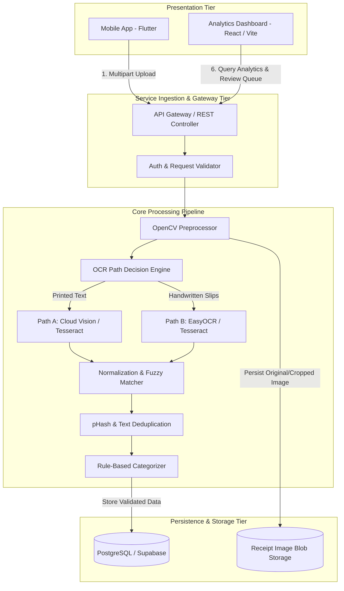
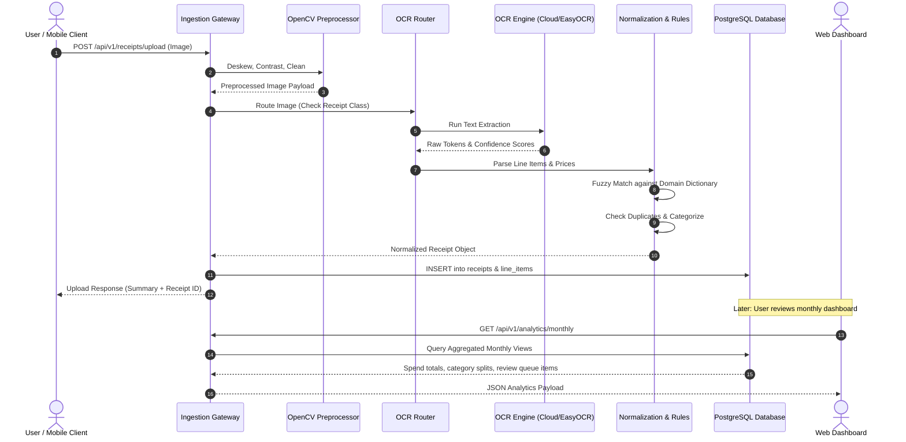

# Software Design Specification (SDS)

### Project: ReceiptLedger
* **Document Version:** 1.0.0
* **Course:** Software Project Management (SPM-458)
* **Institution:** Department of Computer Science, University of Karachi
* **Sprint Cycle:** 3-Week Delivery Lifecycle

---

## 1. Architectural Overview

ReceiptLedger employs a multi-tier, modular pipeline architecture designed to isolate capture, computer vision, natural language normalization, classification, and presentation concerns. 

---

## 2. Subsystem Decompositions

### 2.1 Subsystem 1: Ingestion & Preprocessing
* **Responsibilities:** Receive raw images, assess blur, detect receipt corners, perform four-point perspective transformation, and adjust lighting/contrast.
* **Key Components:**
  * `ImageValidator`: Checks MIME type, file size ($\le 10$ MB), and dimensions.
  * `PerspectiveTransformer`: Uses OpenCV (`cv2.findContours`, `cv2.getPerspectiveTransform`) to straighten angled photos.
  * `AdaptiveBinarizer`: Applies adaptive thresholding (`cv2.adaptiveThreshold`) to separate text strokes from background paper grain.

### 2.2 Subsystem 2: Dual-Engine OCR Pipeline
* **Responsibilities:** Extract text characters, words, and coordinates while balancing accuracy with cloud quota limits.
* **Routing Strategy:**
  * **Path A (Organized Retail):** Clear rectangular grid receipts from branded stores are directed to **Google Cloud Vision API** (`TEXT_DETECTION`). If the free monthly limit (1,000 calls) is reached, traffic gracefully routes to **Tesseract 5** (`--oem 1 --psm 6`).
  * **Path B (Informal / Handwritten):** Irregular slips from local markets are processed by **EasyOCR** (PyTorch-based CRNN architecture, CPU-optimized) combined with local contrast normalization.
* **Output Standard:** Uniform JSON schema containing extracted tokens with 4-point bounding polygons and individual confidence values ($0.0 - 1.0$).

### 2.3 Subsystem 3: Normalization & Fuzzy Domain Correction
* **Responsibilities:** Map messy extracted strings into canonical inventory items.
* **Processing Steps:**
  1. **Line Reassembly:** Sort tokens top-to-bottom, left-to-right into logical line items.
  2. **Numerical Extraction:** Apply regex patterns to isolate quantities (`\d+(\.\d+)?\s*(kg|g|ltr|litre|pkt|box|pcs|dozen)?`) and unit/total costs (`Rs\.?\s*\d+(,\d+)?(\.\d{2})?`).
  3. **Dictionary Lookup & Fuzzy Matching:** Compare raw item names against a curated domain dictionary (built from local grocery and retail goods). Use Levenshtein distance:
     $$\text{Similarity}(s_1, s_2) = 1 - \frac{\text{Levenshtein}(s_1, s_2)}{\max(\text{len}(s_1), \text{len}(s_2))}$$
     If similarity exceeds $0.80$, normalize to the canonical item name.

### 2.4 Subsystem 4: Duplicate Detection & Categorization
* **Duplicate Detection:**
  * **Visual Comparison:** Calculate 64-bit dHash/pHash of the input image. If Hamming distance to an existing receipt image is $\le 4$, flag as suspected duplicate.
  * **Textual Fingerprint:** Compute SHA-256 hash of `(merchant_name + date + total_amount)`.
* **Categorization Engine:**
  * Deterministic rule-matching engine applying priority-ordered keyword filters against the normalized item name.
  * Example: `"flour" | "atta" | "oil" | "rice"` $\rightarrow$ `Groceries & Food`.
  * Items falling below the confidence threshold ($< 0.85$) are tagged with `status: "PENDING_REVIEW"`.

### 2.5 Subsystem 5: Storage & Analytics Service
* **Database:** PostgreSQL schema hosted on Supabase free tier.
* **Aggregations:** SQL views providing monthly rollups, month-over-month deltas, and category spending distributions.
* **Dashboard Client:** React with Chart.js / Tailwind-inspired CSS for rendering responsive charts, tabular logs, and the manual review interface.

---

## 3. End-to-End Processing Sequence

---

## 4. Fault Tolerance & Exception Handling

| Failure Scenario | Impact | Mitigation Strategy |
|:---|:---|:---|
| Cloud Vision API Quota Exceeded | OCR extraction blocked | Automatic failover to local Tesseract 5 engine; log warning. |
| Highly Degraded / Blurred Image | Unreliable OCR | Return HTTP `422 Unprocessable Entity` with explicit message: "Image blur exceeded threshold; please retake with steady lighting." |
| Unrecognized Handwriting Tokens | Missing items / zero price | Item is extracted with `confidence: 0.40` and sent directly to the dashboard **Review Queue** rather than silently discarded or guessed. |
| Network Disconnection during Upload | Incomplete transaction | Mobile client queues receipt image locally in SQLite cache and retries upload when connectivity is restored. |
