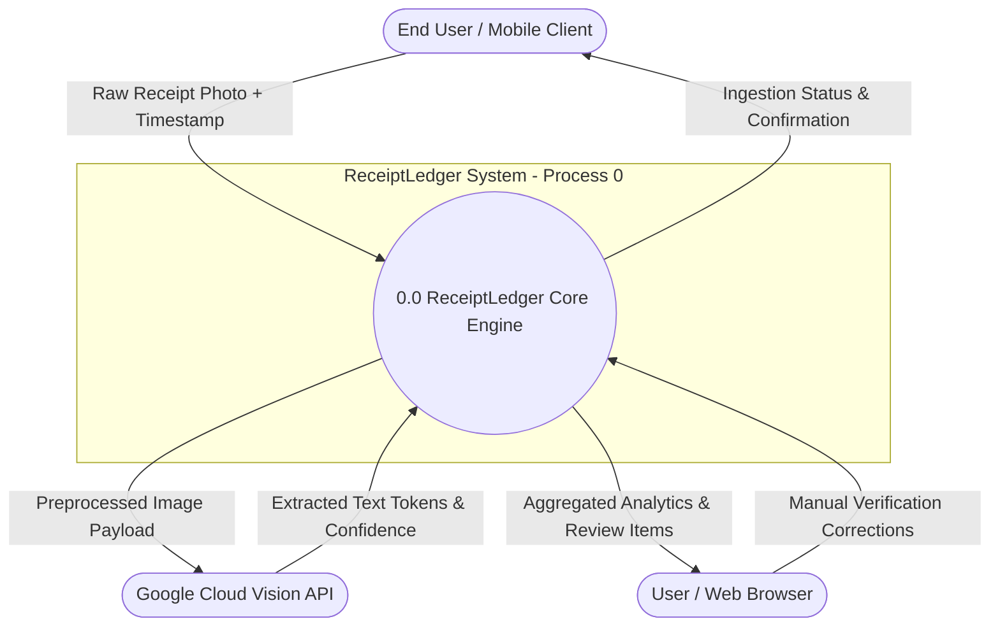
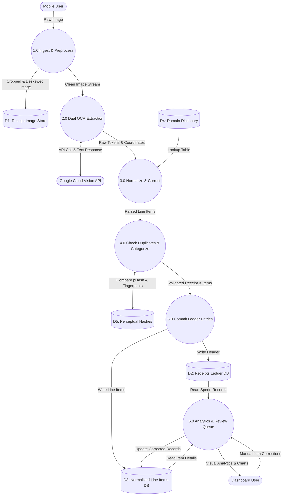

# Data Flow Diagrams (DFD)

### Project: ReceiptLedger
* **Document Version:** 1.0.0
* **Course:** Software Project Management (SPM-458)
* **Institution:** Department of Computer Science, University of Karachi
* **Sprint Cycle:** 3-Week Delivery Lifecycle

---

## 1. DFD Notation & Standards

ReceiptLedger data flow diagrams follow standard Gane-Sarson / Yourdon conventions:
* **External Entities (Rectangles):** Sources or destinations of data outside the system boundary (e.g., User, Cloud Vision API).
* **Processes (Rounded Rectangles):** Actions or transformations performed on data.
* **Data Stores (Open-ended Cylinders/Brackets):** Repositories where data is persisted (e.g., PostgreSQL, Blob Storage).
* **Data Flows (Directed Arrows):** The movement of data packets between entities, processes, and stores.

---

## 2. Level 0: System Context Diagram

The Level 0 Context Diagram depicts the entire ReceiptLedger system as a single process interacting with its external environment.

---

## 3. Level 1: Functional Decomposition

The Level 1 DFD decomposes the system into six primary operational sub-processes.

---

## 4. Sub-Process Breakdown & Data Dictionary

### 4.1 Process Descriptions

| Process ID | Name | Input Data Flow | Output Data Flow | Description |
|:---|:---|:---|:---|:---|
| **1.0** | Ingest & Preprocess | Raw camera photo | Deskewed image, metadata | Assesses image quality, corrects perspective tilt, and writes binary to blob storage. |
| **2.0** | Dual OCR Extraction | Deskewed image | Extracted text tokens | Routes to Cloud Vision (printed) or EasyOCR (handwritten) to produce character strings. |
| **3.0** | Normalize & Correct | Text tokens, Dictionary | Normalized items | Reassembles lines, performs regex price extraction, and resolves fuzzy item matches. |
| **4.0** | Deduplicate & Categorize | Normalized items, pHash | Categorized record, duplicate status | Matches perceptual hash against `DS_Hashes` and assigns items to local spending buckets. |
| **5.0** | Commit Ledger Entries | Categorized record | Database transaction | Inserts structured receipt headers and itemized records into relational tables. |
| **6.0** | Analytics & Review Queue | SQL aggregation queries | Dashboard UI stream | Calculates monthly totals, category deltas, and surfaces low-confidence items for user review. |

### 4.2 Data Flows Dictionary

* **`Raw Receipt Photo`:** Binary image stream (`JPEG`/`PNG`), resolution $\ge 1280 \times 720$, client EXIF timestamp.
* **`Deskewed Image`:** Grayscaled, contrast-normalized, perspective-corrected 2D matrix.
* **`Extracted Text Tokens`:** Array of `{ token: string, bounding_box: [x1, y1, x2, y2], confidence: float }`.
* **`Normalized Items`:** Structured records: `{ canonical_name: string, quantity: float, unit: string, unit_price: float, total_price: float }`.
* **`Perceptual Hash (pHash)`:** 64-bit integer representing low-frequency discrete cosine transform (DCT) features of the receipt image.
* **`Analytics Payload`:** JSON object containing `{ current_month_total, prior_month_delta, category_breakdown: {}, trend_series: [] }`.
