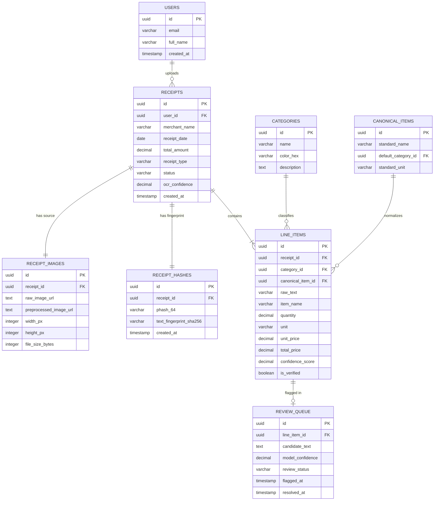

# Entity Relationship Diagram (ERD) & Database Schema

### Project: ReceiptLedger
* **Document Version:** 1.0.0
* **Course:** Software Project Management (SPM-458)
* **Institution:** Department of Computer Science, University of Karachi
* **Sprint Cycle:** 3-Week Delivery Lifecycle

---

## 1. Entity Relationship Model (ERD)

The ReceiptLedger relational model is normalized to Third Normal Form (3NF) to guarantee transactional integrity, eliminate update anomalies, and facilitate efficient aggregation for the spending dashboard.



---

## 2. Relational Schema Specifications

### 2.1 Table: `receipts`
Stores receipt header records extracted during ingestion.
* `id` (`UUID`, Primary Key, Default: `gen_random_uuid()`)
* `user_id` (`UUID`, Foreign Key $\rightarrow$ `users.id`, Indexed)
* `merchant_name` (`VARCHAR(255)`, Nullable — extracted store name)
* `receipt_date` (`DATE`, Date shown on receipt; falls back to upload date)
* `total_amount` (`DECIMAL(10,2)`, Not Null — total bill amount)
* `receipt_type` (`VARCHAR(32)`, Enum: `'PRINTED'`, `'HANDWRITTEN'`)
* `status` (`VARCHAR(32)`, Enum: `'PROCESSED'`, `'PENDING_REVIEW'`, `'DUPLICATE'`)
* `ocr_confidence` (`DECIMAL(4,3)`, Mean token confidence: $0.000 - 1.000$)
* `created_at` (`TIMESTAMPTZ`, Default: `NOW()`)

### 2.2 Table: `line_items`
Stores normalized individual purchase entries extracted from each receipt.
* `id` (`UUID`, Primary Key)
* `receipt_id` (`UUID`, Foreign Key $\rightarrow$ `receipts.id`, `ON DELETE CASCADE`)
* `category_id` (`UUID`, Foreign Key $\rightarrow$ `categories.id`)
* `canonical_item_id` (`UUID`, Foreign Key $\rightarrow$ `canonical_items.id`, Nullable)
* `raw_text` (`TEXT`, Verbatim OCR output string)
* `item_name` (`VARCHAR(255)`, Normalized item description)
* `quantity` (`DECIMAL(8,3)`, Default: `1.000`)
* `unit` (`VARCHAR(32)`, e.g., `'kg'`, `'g'`, `'ltr'`, `'pkt'`, `'pcs'`)
* `unit_price` (`DECIMAL(10,2)`, Price per unit)
* `total_price` (`DECIMAL(10,2)`, Computed line total)
* `confidence_score` (`DECIMAL(4,3)`, Item-level OCR confidence)
* `is_verified` (`BOOLEAN`, Default: `FALSE`)

### 2.3 Table: `receipt_hashes`
Used for rapid perceptual and cryptographic duplicate detection.
* `id` (`UUID`, Primary Key)
* `receipt_id` (`UUID`, Foreign Key $\rightarrow$ `receipts.id`, `ON DELETE CASCADE`)
* `phash_64` (`VARCHAR(64)`, 64-bit hexadecimal perceptual image hash, Indexed)
* `text_fingerprint_sha256` (`VARCHAR(64)`, SHA-256 hash of `merchant + date + amount`, Indexed)
* `created_at` (`TIMESTAMPTZ`, Default: `NOW()`)

### 2.4 Table: `review_queue`
Surfaces low-confidence OCR items requiring human confirmation.
* `id` (`UUID`, Primary Key)
* `line_item_id` (`UUID`, Foreign Key $\rightarrow$ `line_items.id`, `ON DELETE CASCADE`)
* `candidate_text` (`TEXT`, Proposed OCR text and coordinates)
* `model_confidence` (`DECIMAL(4,3)`, OCR confidence value below $0.85$)
* `review_status` (`VARCHAR(32)`, Enum: `'UNRESOLVED'`, `'ACCEPTED'`, `'EDITED'`)
* `flagged_at` (`TIMESTAMPTZ`, Default: `NOW()`)
* `resolved_at` (`TIMESTAMPTZ`, Nullable)

---

## 3. SQL Data Definition Language (PostgreSQL / Supabase DDL)

```sql
-- Enable UUID extension
CREATE EXTENSION IF NOT EXISTS "uuid-ossp";

-- Categories Table
CREATE TABLE categories (
    id UUID PRIMARY KEY DEFAULT gen_random_uuid(),
    name VARCHAR(100) NOT NULL UNIQUE,
    color_hex VARCHAR(7) NOT NULL,
    description TEXT
);

-- Seed Baseline Categories
INSERT INTO categories (name, color_hex, description) VALUES
('Groceries & Food', '#10B981', 'Staples, dairy, flour, produce, and fresh meat'),
('Household & Cleaning', '#3B82F6', 'Detergents, cleaning supplies, and paper goods'),
('Personal Care', '#8B5CF6', 'Toiletries, skincare, and hygiene essentials'),
('Utilities & Bills', '#F59E0B', 'Electricity, gas, water, and top-up bills'),
('Snacks & Beverages', '#EC4899', 'Confectionery, soft drinks, tea, and bakeries'),
('Miscellaneous', '#6B7280', 'Unclassified or irregular expenses');

-- Receipts Table
CREATE TABLE receipts (
    id UUID PRIMARY KEY DEFAULT gen_random_uuid(),
    user_id UUID NOT NULL,
    merchant_name VARCHAR(255),
    receipt_date DATE NOT NULL DEFAULT CURRENT_DATE,
    total_amount DECIMAL(10,2) NOT NULL,
    receipt_type VARCHAR(32) NOT NULL CHECK (receipt_type IN ('PRINTED', 'HANDWRITTEN')),
    status VARCHAR(32) NOT NULL DEFAULT 'PROCESSED',
    ocr_confidence DECIMAL(4,3) NOT NULL,
    created_at TIMESTAMPTZ NOT NULL DEFAULT NOW()
);

-- Line Items Table
CREATE TABLE line_items (
    id UUID PRIMARY KEY DEFAULT gen_random_uuid(),
    receipt_id UUID NOT NULL REFERENCES receipts(id) ON DELETE CASCADE,
    category_id UUID NOT NULL REFERENCES categories(id),
    raw_text TEXT NOT NULL,
    item_name VARCHAR(255) NOT NULL,
    quantity DECIMAL(8,3) NOT NULL DEFAULT 1.000,
    unit VARCHAR(32) NOT NULL DEFAULT 'pcs',
    unit_price DECIMAL(10,2) NOT NULL,
    total_price DECIMAL(10,2) NOT NULL,
    confidence_score DECIMAL(4,3) NOT NULL,
    is_verified BOOLEAN NOT NULL DEFAULT FALSE
);

-- Duplicate Hashes Table
CREATE TABLE receipt_hashes (
    id UUID PRIMARY KEY DEFAULT gen_random_uuid(),
    receipt_id UUID NOT NULL REFERENCES receipts(id) ON DELETE CASCADE,
    phash_64 VARCHAR(64) NOT NULL,
    text_fingerprint_sha256 VARCHAR(64) NOT NULL,
    created_at TIMESTAMPTZ NOT NULL DEFAULT NOW()
);
CREATE INDEX idx_receipt_hashes_phash ON receipt_hashes(phash_64);
CREATE INDEX idx_receipt_hashes_text ON receipt_hashes(text_fingerprint_sha256);
```
