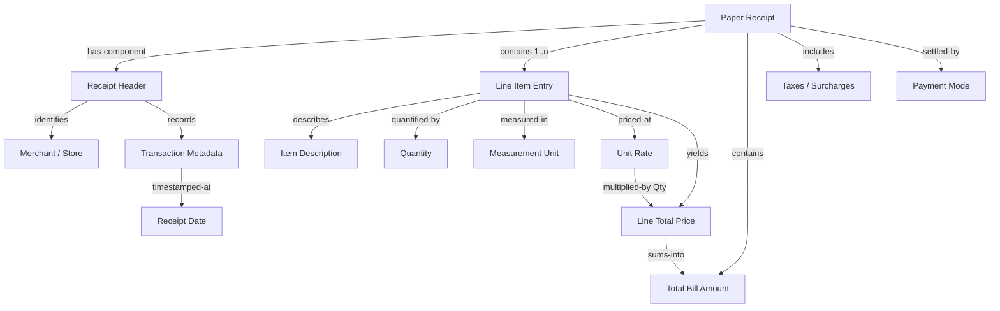
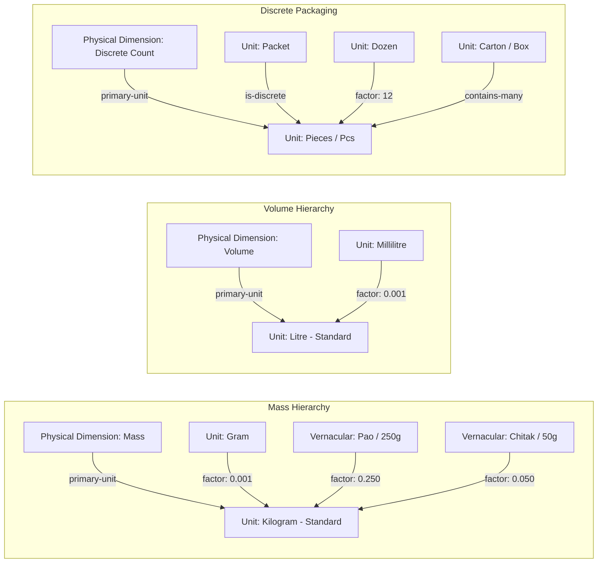

# Semantic Networks & Domain Knowledge Representation

### Project: ReceiptLedger
* **Document Version:** 1.0.0
* **Course:** Software Project Management (SPM-458)
* **Institution:** Department of Computer Science, University of Karachi
* **Sprint Cycle:** 3-Week Delivery Lifecycle

---

## 1. Introduction to Semantic Networks in ReceiptLedger

A **Semantic Network** represents knowledge using a graph of interconnected nodes (concepts, physical entities, and values) linked by directed, labeled relationship arcs (such as `is-a`, `part-of`, `synonym-of`, `measured-in`, and `classified-as`).

In ReceiptLedger, semantic networks formalize the domain knowledge required to bridge the gap between noisy raw OCR strings (which often include dialect terms, brand names, and idiosyncratic abbreviations) and standard structured spending data.

---

## 2. Receipt Structural Ontology Network

This network models the anatomy of a paper receipt and how raw tokens relate to legal and accounting concepts.

---

## 3. Local Retail & Household Taxonomy Network

This semantic network models real-world retail vocabulary encountered on local receipts (both organized retail like Imtiaz/Carrefour and informal neighbourhood *kiryana* stores). It shows how colloquial brand names and vernacular terms resolve to canonical concepts and broad spending categories.

```mermaid
graph TD
    %% Categories
    CatGrocery[Category: Groceries & Food]
    CatHousehold[Category: Household & Cleaning]
    CatPersonal[Category: Personal Care]
    CatBeverage[Category: Snacks & Beverages]

    %% Canonical Concepts
    Flour[Canonical: Wheat Flour]
    Oil[Canonical: Cooking Oil / Ghee]
    Rice[Canonical: Rice]
    Milk[Canonical: Dairy Milk]
    Detergent[Canonical: Laundry Detergent]
    Soap[Canonical: Bathing Soap]
    Tea[Canonical: Black Tea Leaf]
    Biscuits[Canonical: Bakery Biscuits]

    %% Brand & Vernacular Instances
    Atta1[Instance: Chakki Atta]
    Atta2[Instance: Fine Atta]
    Oil1[Instance: Dalda Banaspati]
    Oil2[Instance: Habib Canola Oil]
    Rice1[Instance: Super Basmati Rice]
    Rice2[Instance: Sela Rice]
    Milk1[Instance: Olpers Milk 1L]
    Milk2[Instance: Khula Doodh]
    Det1[Instance: Surf Excel 500g]
    Det2[Instance: Ariel Washing Powder]
    Tea1[Instance: Tapal Danedar]
    Tea2[Instance: Lipton Yellow Label]

    %% Taxonomy Relationships
    Atta1 -->|is-a| Flour
    Atta2 -->|is-a| Flour
    Oil1 -->|is-a| Oil
    Oil2 -->|is-a| Oil
    Rice1 -->|is-a| Rice
    Rice2 -->|is-a| Rice
    Milk1 -->|is-a| Milk
    Milk2 -->|is-a| Milk

    Det1 -->|is-a| Detergent
    Det2 -->|is-a| Detergent
    Tea1 -->|is-a| Tea
    Tea2 -->|is-a| Tea

    %% Categorization mappings
    Flour -->|classified-as| CatGrocery
    Oil -->|classified-as| CatGrocery
    Rice -->|classified-as| CatGrocery
    Milk -->|classified-as| CatGrocery

    Detergent -->|classified-as| CatHousehold
    Soap -->|classified-as| CatPersonal
    Tea -->|classified-as| CatBeverage
    Biscuits -->|classified-as| CatBeverage
```

---

## 4. Measurement Units & Vernacular Equivalency Network

To prevent calculations from corrupting (e.g., treating `500g` as `500kg`), the semantic network defines unit normalization relationships and conversion factors.

---

## 5. Algorithmic Utilization in ReceiptLedger

The semantic networks defined above are directly implemented within the ReceiptLedger processing pipeline:

1. **OCR Post-Processing:**
   * When raw text produces a low-confidence token like `"Chki Ata"`, the string is matched across synonyms in the network (`"Chakki Atta"` $\rightarrow$ `Wheat Flour`).
2. **Deterministic Inheritance:**
   * Because `Wheat Flour` has an arc `classified-as -> Groceries & Food`, the item inherits this classification without requiring an external machine learning model.
3. **Unit Validation:**
   * If a receipt line is parsed as `"Tapal Danedar 950g"`, the system traverses the mass network to verify that `950g` is a valid volume/mass modifier rather than an unassociated price token.
