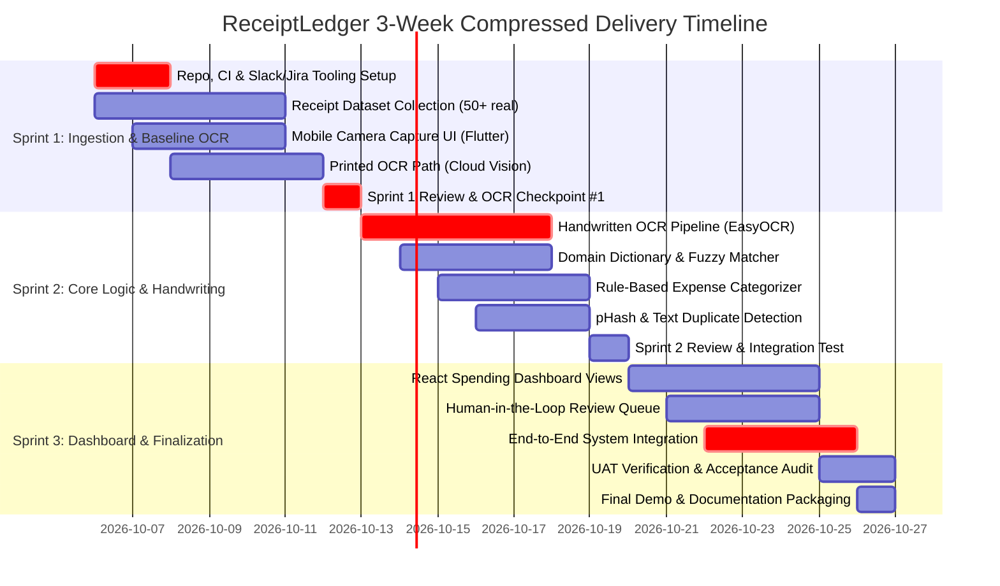

# 3-Week Sprint Execution Plan

### Project: ReceiptLedger
* **Document Version:** 1.0.0
* **Course:** Software Project Management (SPM-458)
* **Institution:** Department of Computer Science, University of Karachi
* **Framework:** Agile Scrum (Compressed 3-Week Delivery Cadence)
* **Team Leadership:** Muhammad Asad Khan (Team Lead)
* **Team Roles & Ticket Assignment:** *Explicitly unassigned — to be allocated directly by Team Lead.*

---

## 1. Executive Summary & Cadence

To meet course deliverables while ensuring high software quality, the earlier 6-sprint timeline has been consolidated into a **3-Week Sprint Plan** (1-week sprints). 

Lightweight daily standups and Jira burndown tracking ensure that scope drift is identified within 24 hours. The OCR accuracy checkpoint between printed and handwritten workflows occurs at the end of Week 1 / start of Week 2.

---

## 2. Sprint-by-Sprint Breakdown

### Sprint 1: Setup, Data Collection, Mobile Capture & Printed OCR
* **Timeline:** Week 1 (Days 1 – 7)
* **Goal:** Establish team infrastructure, build mobile capture screen, collect ground-truth receipts, and validate printed OCR accuracy.

| Issue Key | Subsystem | Story Description | Priority | Assignee |
|:---|:---|:---|:---:|:---:|
| `RL-101` | Infrastructure | Configure GitHub repository, branch protection, and Slack webhook alerts | High | Muhammad Asad Khan |
| `RL-102` | Infrastructure | Configure Jira Scrum board, backlog epics, and burndown chart | High | Arish Ahmed Khan |
| `RL-103` | Data Collection | Collect and label initial dataset of 50+ printed and handwritten receipts | High | Zainab Hashmi |
| `RL-104` | Mobile Client | Build mobile receipt camera capture screen & Google Stitch mockups | High | Aazmeer Sarfaraz Faridy |
| `RL-105` | Ingestion API | Implement multipart image upload endpoint and OpenCV deskewing | High | Muhammad Asad Khan |
| `RL-106` | OCR Engine | Integrate Google Cloud Vision API for printed retail receipts | High | Muhammad Asad Khan |
| `RL-107` | OCR Engine | Implement local Tesseract 5 fallback for quota overflow protection | Medium | Muhammad Asad Khan |

* **Sprint 1 Exit Criteria:**
  - Working repository, Jira board, and Slack integrations active.
  - Mobile client successfully captures and uploads receipt images.
  - Printed OCR path demonstrates $\ge 90\%$ accuracy on sample printed receipts.
  - Checkpoint #1: Assess sample difficulty for handwritten receipts before Sprint 2 kickoff.

---

### Sprint 2: Handwritten OCR, Normalization, Categorization & Deduplication
* **Timeline:** Week 2 (Days 8 – 14)
* **Goal:** Solve extraction for handwritten receipts, build dictionary-based item normalization, implement rule categorization, and enable duplicate detection.

| Issue Key | Subsystem | Story Description | Priority | Assignee |
|:---|:---|:---|:---:|:---:|
| `RL-201` | OCR Engine | Implement EasyOCR pipeline with preprocessing for handwritten notes | High | Muhammad Asad Khan |
| `RL-202` | Normalization | Build local retail dictionary and Levenshtein fuzzy-matching engine | High | Muhammad Asad Khan |
| `RL-203` | Normalization | Implement regex parsers for item quantities, units, and line totals | High | Muhammad Asad Khan |
| `RL-204` | Categorization | Implement rule-based classification engine for spending taxonomy | High | Muhammad Asad Khan |
| `RL-205` | Deduplication | Implement 64-bit perceptual image hashing (pHash) comparator | Medium | Muhammad Asad Khan |
| `RL-206` | Deduplication | Implement textual metadata fingerprinting (`store + date + amount`) | Medium | Muhammad Asad Khan |
| `RL-207` | Persistence | Configure Supabase/PostgreSQL schema and database migrations | High | Muhammad Asad Khan |

* **Sprint 2 Exit Criteria:**
  - Handwritten receipt OCR achieves $\ge 70\%$ word accuracy post-domain correction.
  - Rule-based categorization maps $\ge 85\%$ of standard items without user intervention.
  - System reliably detects intentionally re-uploaded duplicate receipts.
  - Normalization engine delivers clean JSON outputs into the database.

---

### Sprint 3: Analytics Dashboard, End-to-End Integration, UAT & Demo Prep
* **Timeline:** Week 3 (Days 15 – 21)
* **Goal:** Deliver interactive spending dashboard, integrate the complete pipeline, perform User Acceptance Testing (UAT), and prepare the project demo.

| Issue Key | Subsystem | Story Description | Priority | Assignee |
|:---|:---|:---|:---:|:---:|
| `RL-301` | Dashboard UI | Build monthly spending summary card and delta vs. previous month | High | Iman Hussain |
| `RL-302` | Dashboard UI | Build category-wise breakdown chart (donut/bar) with drill-down | High | Iman Hussain |
| `RL-303` | Dashboard UI | Implement multi-month spending trend visualization | Medium | Iman Hussain |
| `RL-304` | Dashboard UI | Implement searchable receipt historical ledger with item view | Medium | Iman Hussain |
| `RL-305` | Review Queue | Build human-in-the-loop review queue for low-confidence scans | High | Iman Hussain |
| `RL-306` | Integration | Hardening and end-to-end integration (Mobile $\rightarrow$ Pipeline $\rightarrow$ DB $\rightarrow$ Web) | High | Muhammad Asad Khan |
| `RL-307` | Quality Assurance | Execute UAT testing against acceptance criteria defined in SoW | High | Syed Aun Shamsi |
| `RL-308` | Project Delivery | Final documentation packaging, demo recording, and submission readiness | High | Arish Ahmed Khan |

* **Sprint 3 Exit Criteria:**
  - Complete round-trip workflow verified: Photo taken $\rightarrow$ items digitized $\rightarrow$ visible in dashboard.
  - Review queue enables quick verification of low-confidence items.
  - All SMART acceptance criteria verified on test dataset.
  - Final documentation and live demonstration ready for evaluation by Humera Azam.

---

## 3. Team Rituals & Governance

* **Daily Async Standup:** Completed via Slack `#daily-standup` by 12:00 PM daily. Each member reports:
  1. *What did I complete yesterday?*
  2. *What will I work on today?*
  3. *Any blockers or impediments?*
* **Sprint Review & Demo:** Held at the conclusion of each week to review working software increments.
* **Scope Protection Rule:** Under the 3-week cadence, if an issue slips past 48 hours, its scope is trimmed immediately rather than pushing back the final delivery deadline.
